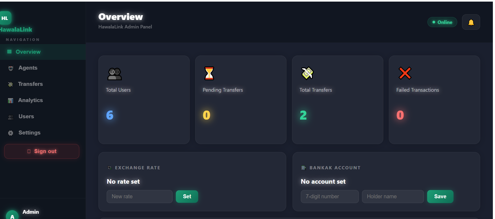
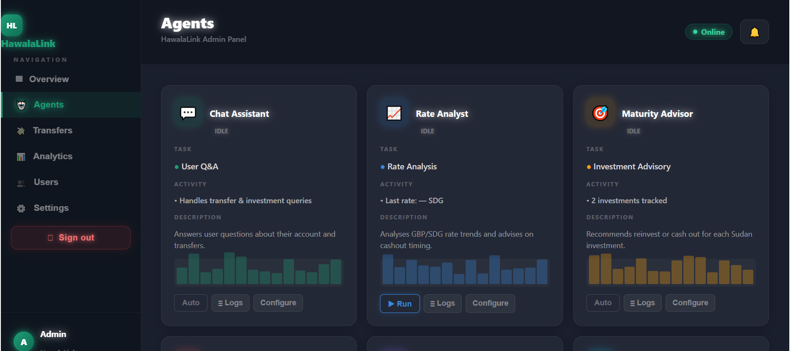
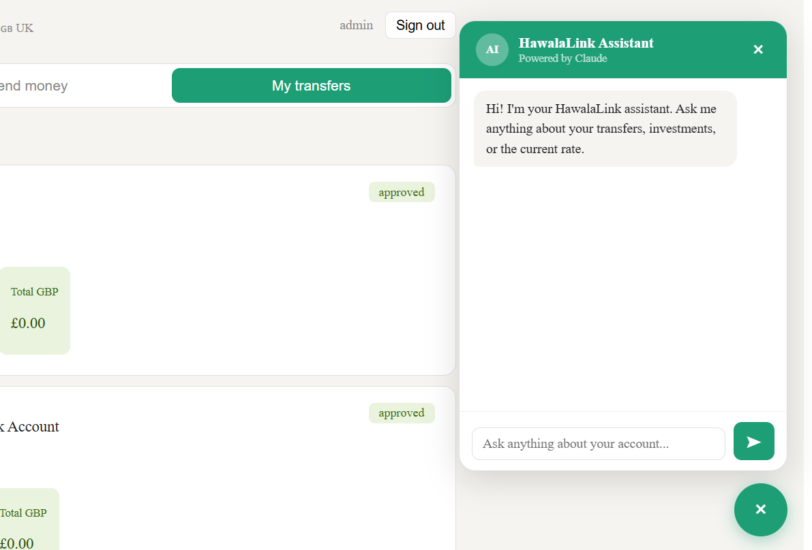

# transfer-system-django
 It is  AI-powered  money transfer and investment platform.
 
# 📖 About
It allows UK users to send money to Nigeria instantly with transparent fees and real-time exchange rates. Nigeria users can send money and invest it over 6, 9, or 12 month periods, tracking how their SDG grows in GBP value as exchange rates shift — with options to cash out or reinvest at maturity.
The platform is managed through a full admin dashboard with sidebar navigation, where admins set exchange rates, manage Bankak payment accounts, approve or reject transfers, and monitor the platform through 6 built-in AI agents — covering fraud detection, liquidity monitoring, rate analysis, investment advisory, financial reporting, and a user chat assistant.
# ✨ Features
# 👤 User Features
🇬🇧 UK Dashboard — Send money to Sudan with live fee breakdown and real-time GBP/SDG preview
🇸🇩 Sudan Dashboard — Create investments (6/9/12 month periods), track GBP value live, cash out or reinvest
💬 AI Chat Assistant — Ask anything about your transfers, investments, or the current rate
🏦 Bankak Payment — Secure payment details shown after each investment with one-tap copy
📈 Investment Tracker — Live gain/loss vs submission rate, progress bar, days remaining
🔄 Reinvest Option — Roll over matured investments with no extra service charge

# 🛡️ Admin Features

📊 Dark Dashboard — Sidebar navigation with Overview, Agents, Transfers, Analytics, Users, Settings
💱 Rate Management — Set live GBP/SDG exchange rate from the dashboard
✅ Transfer Approval — Approve or reject transfers with full transaction details
🏦 Bankak Account Settings — Set the 7-digit Bankak account number users pay into
🔔 Notifications — Bell icon with unread count, 10-day maturity alerts via email
📊 Analytics — Bar charts for revenue, user growth, transfer volume, investment status

# 🤖 AI Agents (Powered by Claude)
AgentRole💬 Chat AssistantAnswers user questions with full account context📈 Rate AnalystAnalyses rate trends, advises on best cashout timing🎯 Maturity AdvisorRecommends reinvest or cash out per investment🔍 Fraud DetectorRisk scores pending transfers (0–100) with flags💧 Liquidity MonitorTracks SDG reserves, warns of cashout risks🧮 AI AccountantGenerates weekly/monthly reports, answers finance questions
 
 
# 🌍 Landing Page
Bilingual English/Arabic with RTL support
Bold modern dark design with gradient hero
Features, How it works, Pricing, and CTA sections

# 🛠️ Tech Stack
Backend
Django 4.x – REST API, models, authentication
Django REST Framework – API endpoints, serializers, permissions
Simple JWT – Token-based authentication
PostgreSQL – Primary database
python-dateutil – Investment maturity date calculations
Anthropic Claude API – Powers 6 AI agents
Tesseract OCR – Receipt verification
Frontend
React 18 – UI components and app structure
React Router v6 – Client-side routing and protected routes
Axios – API calls with JWT interceptors
Vite – Development server and build tool
Inline Styles – Component-scoped styling (no CSS framework)

# 🚀 How to Run
Prerequisites

Python 3.10+
Node.js 18+
PostgreSQL
An Anthropic API key

1. Clone the repo
bashgit clone https://github.com/zahran7770/transfer-system-django.git
cd hawalalink
2. Backend setup
bashcd backend

# Create and activate virtual environment
python -m venv venv
venv\Scripts\activate        # Windows
# source venv/bin/activate   # Mac/Linux

# Install dependencies
pip install -r requirements.txt

# Create .env file
cp .env.example .env
# Fill in: DATABASE_URL, SECRET_KEY, ANT
